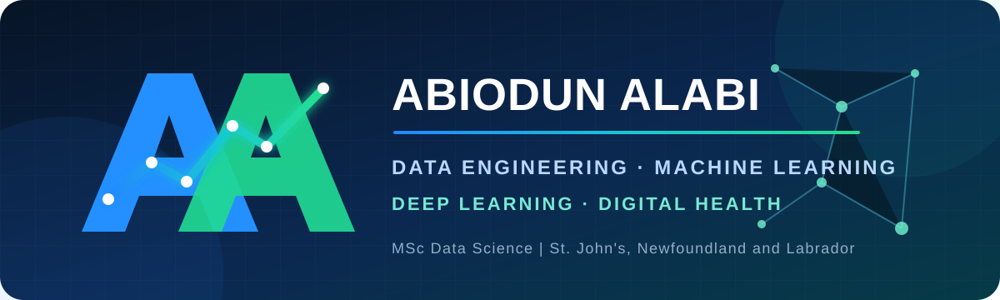

### Data Engineering · Machine Learning · Statistical Modelling · Deep Learning

I work across the full data cycle—from designing dependable data systems to statistical inference, machine learning, neural networks, computer vision, and decision-focused products.

On GitHub since February 2016 · Selected work is being documented and added progressively

---

## About me

I am a data professional with a background spanning data engineering, statistical analysis, machine learning, epidemiology, database systems, digital health, cloud services, and technical delivery. Much of my career has involved turning complex programme and operational data into systems that teams can rely on—from Nigeria's national HIV information platforms to stochastic models, classification systems, computer-vision models, business intelligence dashboards, and data-driven products.

I hold an MSc in Data Science from Memorial University of Newfoundland and bring more than 15 years of experience across public health, technology, and organisational data systems. I am now based in St. John's, Newfoundland and Labrador.

## Tools I use

  
  
  
  
  
  
  
  
  
  
  

`Data engineering` · `Statistical inference` · `Classification` · `Regression` · `Cluster analysis` · `Time series` · `CNNs` · `Neural networks` · `Gradient methods` · `Model evaluation` · `Epidemiology` · `Data quality`

## MSc-level data science and statistics

| Work | Technical depth |
|:---|:---|
| **SVHN Multi-Digit House Number Recognition** | Prepared the original Street View House Numbers data using bounding-box annotations to isolate complete number sequences. Built training, validation, and test sets of **84,016**, **9,336**, and **13,066** images, resized to `64 × 128`, with sequences of up to four digits. |
| **Convolutional Neural Network for Sequence Recognition** | Developed a multi-output CNN for digit-sequence prediction using ten real digit classes per position. Applied masked loss for inactive positions and selected checkpoints using validation macro sequence accuracy. |
| **Computer-Vision Model Evaluation** | Evaluated exact-sequence accuracy, character accuracy, number-length accuracy, per-position performance, per-length performance, and confusion matrices rather than relying on one headline metric. |
| **Machine-Learning Classification and Regression** | Worked through feature preparation, train/validation/test design, cross-validation, model comparison, overfitting control, and evaluation using accuracy, precision, recall, confusion matrices, residual behaviour, and error analysis. |
| **Gradient-Based Learning** | Applied gradient-driven optimisation concepts to loss minimisation, backpropagation, learning-rate behaviour, convergence, regularisation, and neural-network training. |
| **Cluster Analysis** | Used unsupervised-learning principles including data standardisation, distance-based similarity, cluster formation, validation, and interpretation of segments where labelled outcomes were unavailable. |
| **AAPL Stochastic-Volatility Modelling** | Modelled time-varying uncertainty in Apple stock returns in R with `stochvol`, combining time-series preparation, stochastic-volatility estimation, uncertainty analysis, diagnostic interpretation, and clear presentation of results. |
| **Statistical Foundations** | Applied probability, sampling, estimation, hypothesis testing, regression, time-series reasoning, uncertainty quantification, and careful distinction between association, prediction, and causal interpretation. |

## Applied machine learning, analytics and BI

| Project | Focus | Stack |
|:---|:---|:---|
| [**ED Pulse — Emergency Department Analytics**](https://public.tableau.com/app/profile/alabi.abiodun/viz/EmergencyDepartmentAnalytics_17876744117970/EDPulseIntroduction) | Patient demand, flow, clinical indicators, referrals, age groups, and operational patterns across a multi-page dashboard | Tableau, calculated fields, healthcare analytics |
| **GlucoInsight — Diabetes Risk Classification** | Clinical, lifestyle, and demographic risk analysis alongside classification-model performance, feature behaviour, and country-level patterns | Python, scikit-learn, Tableau, Power BI |
| **Mental Health Pattern Analysis** | Demographic, lifestyle, workplace, and mental-health relationships presented through three connected analytical views | Tableau, Power BI, data preparation |
| **Stock Market Analytics** | Price and return trends, company comparison, gain/loss measures, Top-N analysis, and daily refresh tracking | Tableau, financial analytics, time series |
| **Healthcare Analysis in R** | Reproducible encounter-level cleaning, clinic summaries, patient-level record checks, orphan-record detection, monthly trends, and validation of missing or implausible values | R, `tidyverse`, `lubridate`, `ggplot2` |
| **Power BI Data Models and Dashboards** | Developed decision-focused reports with dimensional models, date tables, DAX measures, filter context, clear KPI definitions, exceptions, trends, and refresh indicators | Power BI, Power Query, DAX, star schema |
| **Abuja Prep Search Performance** | Search queries, pages, countries, devices, clicks, impressions, weighted CTR, and weighted position | Tableau, Search Console data |
| **Excel Financial Reconciliation and Transformation** | Reconciled statements and workbooks, verified balances and transaction direction, identified discrepancies, applied controlled transformation rules, and preserved an audit-friendly record of changes | Excel, PivotTables, validation, reconciliation |

## Public-health systems

| Programme | Contribution | Period |
|:---|:---|:---:|
| [**eNNRIMS DHIS2 Deployment**](https://ennrims.naca.gov.ng/dhis-web-commons/security/login.action#/) | Managed the national rollout of Nigeria's HIV response database, supported training for 5,000+ users, and enabled reporting from 1,000+ service-delivery organisation units | 2018 |
| [**eNNRIMS DHIS2 Dashboards**](https://ennrims.naca.gov.ng/dhis-web-dashboard/) | Delivered national HIV programme dashboards and reporting workflows used for monitoring and programme management | 2018–present |
| **NACA Command Centre for HIV and Related Diseases** | Developed decision-support dashboards bringing priority indicators together for executive monitoring and coordinated response | NACA |
| **NACA Call Centre FAQ Dashboard** | Built an operational view of frequently asked questions, information needs, service patterns, and call-centre reporting | NACA |
| **Mathematical Modelling for HIV Projections** | Modelled HIV transmission and intervention scenarios to support national planning | 2013 |
| **NOMIS 2.0 DevOps and Data Migration** | Supported production systems, investigated recurring issues, and developed migration tools for legacy NGO data | 2023–2024 |
| **Global Fund Recruitment Portal and Analytics** | Designed the recruitment portal and supported data filtering, longlisting, and shortlisting | NACA / Global Fund |

The eNNRIMS work was delivered with NACA and partners including the Global Fund and World Bank.

My epidemiological work includes interpreting incidence and prevalence in context, checking denominators and case definitions, distinguishing genuine disease patterns from reporting artefacts, and translating surveillance results into information programme teams can use.

## Products and platforms

| Product | What I worked on |
|:---|:---|
| [**RutaDocs**](https://rutadocs.com/) | Founded and developed a platform for immigration documentation, milestones, reminders, SOP drafting, and professional-service workflows |
| **RutaDocs Global Education Database** | Designed a standardised institution-and-course schema and migration process for multi-country education data |
| **RutaDocs Immigration Eligibility Checker** | Designed a rules-based assessment flow that uses institution type, pathway, occupation, NOC, and TEER details to determine relevant requirements |
| [**NACA digital platforms**](https://naca.gov.ng/) | Built and maintained websites, reporting interfaces, cloud services, Microsoft 365 services, and database-backed applications |
| **Contract Lifecycle Management System** | Designed a web-based platform for contract workflows and organisational records |
| **Peer Education Portal** | Developed a portal supporting peer-education activities and programme information |
| [**Klious School Management System**](https://www.klious.com/) | Built a school-management system for core administrative and information workflows |
| **Cloud and collaboration modernisation** | Supported organisational migration to Oracle Cloud and Microsoft 365, covering infrastructure, email, identity, and collaboration services |

## What I bring to a team

| Analytics | Data and platforms | Delivery |
|:---|:---|:---|
| KPI design, epidemiology, statistical modelling, classification, forecasting, and visualisation | SQL, database design, ETL, migration, R, Power BI, Excel, DHIS2, cloud services, and web analytics | National rollouts, stakeholder engagement, user training, documentation, and root-cause analysis |

## Currently

- Building practical analytics for public-health and operational decisions
- Expanding RutaDocs and its underlying education and immigration data systems
- Publishing selected Tableau, Power BI, SQL, Python, R, and Excel work
- Open to data analyst, business intelligence, analytics engineering, data science, and digital-health opportunities

---

### Explore my work

[Tableau Public](https://public.tableau.com/app/profile/alabi.abiodun/vizzes) · [RutaDocs](https://rutadocs.com/) · [NACA](https://naca.gov.ng/) · [GitHub](https://github.com/amourab)

